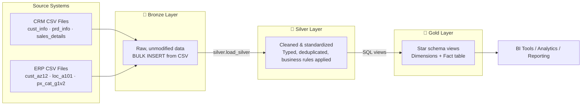
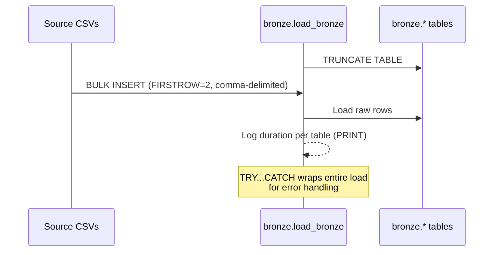
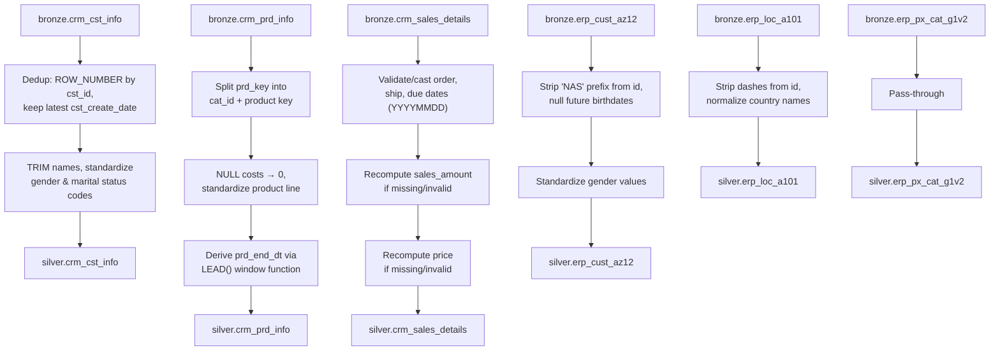
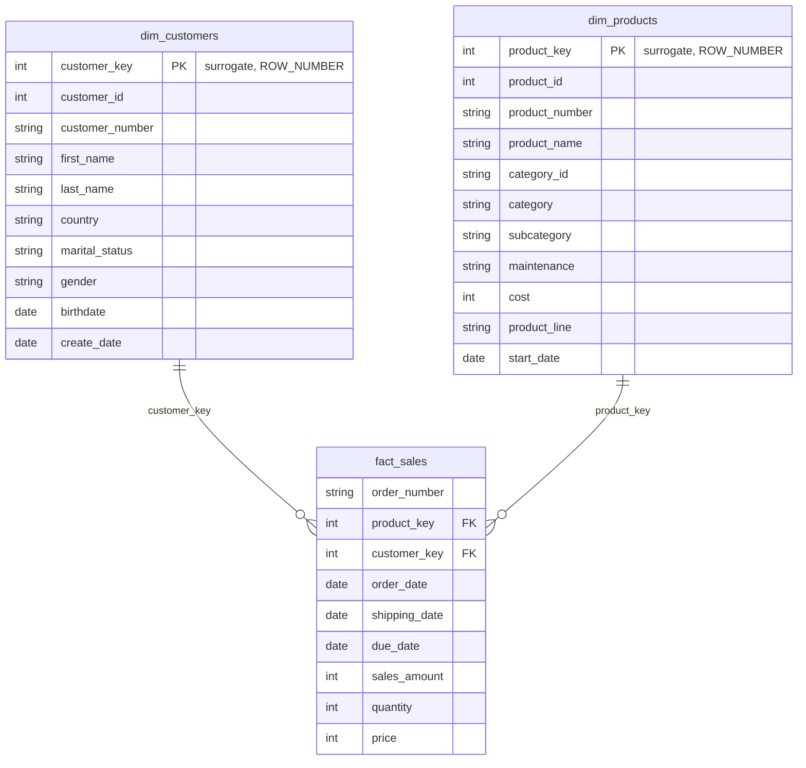

# Enterprise Data Warehouse

A SQL Server data warehouse built on the **Medallion Architecture** (Bronze → Silver → Gold), integrating customer, product, and sales data from two source systems - a CRM and an ERP - into a clean, query-ready star schema for analytics and reporting.

## Architecture

Data flows through three progressively refined layers. Each layer is a SQL Server schema (`bronze`, `silver`, `gold`) inside the `dataWarehouse` database.



| Layer | Object type | Purpose |
|---|---|---|
| **Bronze** | Tables | Raw 1:1 copy of source CSVs, no transformation |
| **Silver** | Tables | Cleaned, deduplicated, standardized, business rules applied |
| **Gold** | Views | Dimensional model (star schema) ready for consumption |

## ETL Process

### 1. Extract & Load - Bronze Layer

Source CSVs are loaded as-is into `bronze` tables via `BULK INSERT`, orchestrated by the `bronze.load_bronze` stored procedure. Each load truncates the target table first (full refresh, not incremental).



**Tables loaded:** `crm_cst_info`, `crm_prd_info`, `crm_sales_details`, `erp_cust_az12`, `erp_loc_a101`, `erp_px_cat_g1v2`

### 2. Transform - Silver Layer

`silver.load_silver` reads from `bronze` and applies cleansing rules before inserting into `silver` tables. Key transformations:



Notable business rules:
- **Deduplication**: customer records are deduplicated by `cst_id`, keeping the row with the latest `cst_create_date` (handles historical records with NULLs in older versions).
- **Composite key splitting**: `prd_key` in CRM product data actually encodes a category ID in its first 5 characters; this is split into `cat_id` and a cleaned `prd_key`.
- **Slowly changing history**: `prd_end_dt` is derived by looking at the *next* row's start date per product (`LEAD()`), reconstructing validity periods from a table that only stored start dates.
- **Sales integrity**: `sales_amount` and `price` are recalculated when they're missing, negative, or mathematically inconsistent with quantity.
- **Cross-system standardization**: gender and country values are normalized differently across CRM and ERP (e.g., `US`/`USA` → `United State`, `DE` → `Germany`).
- All `silver` tables carry a `dwh_create_date` audit column defaulting to `GETDATE()`.

### 3. Model - Gold Layer

Gold is a set of SQL **views** (not materialized tables) that join `silver` tables into a Kimball-style star schema: two dimensions and one fact.



- `dim_customers` merges CRM customer master data with ERP demographic (`erp_cust_az12`) and location (`erp_loc_a101`) data. CRM is the source of truth for gender; ERP fills gaps.
- `dim_products` merges CRM product data with ERP category metadata, filtering to only **current** products (`prd_end_dt IS NULL`) - historical product versions are excluded from the dimension.
- `fact_sales` joins cleansed sales transactions to both dimensions via surrogate keys.

## Repository Structure

```
enterprise-datawarehouse/
├── data/
│   ├── source_crm/          # cust_info.csv, prd_info.csv, sales_details.csv
│   └── source_erp/          # cust_az12.csv, loc_a101.csv, px_cat_g1v2.csv
├── scripts/
│   ├── init_database.sql    # Creates dataWarehouse DB + bronze/silver/gold schemas
│   ├── bronze/
│   │   ├── ddl_bronze.sql        # Bronze table definitions
│   │   └── load_bronze_proc.sql  # BULK INSERT load procedure
│   ├── silver/
│   │   ├── ddl_silver.sql        # Silver table definitions
│   │   └── load_silver_proc.sql  # Cleansing/transformation procedure
│   └── gold/
│       └── ddl_gold.sql          # Dimension & fact views
├── test/
│   ├── script_for_consistency_check(Silver).sql
│   └── script_for_consistency_check(Gold).sql
├── LICENSE
└── README.md
```

## Setup

1. **Create the database and schemas**
   ```sql
   -- run in SSMS / Azure Data Studio, connected as a user with CREATE DATABASE rights
   scripts/init_database.sql
   ```
   ⚠️ This drops any existing `dataWarehouse` database with the same name - back up first if needed.

2. **Create Bronze tables and load raw data**
   ```sql
   scripts/bronze/ddl_bronze.sql
   ```
   Before running the load procedure, replace every `'{your location}\...'` file path in `scripts/bronze/load_bronze_proc.sql` with the absolute path to your local `data/` folder.
   ```sql
   scripts/bronze/load_bronze_proc.sql   -- creates + executes bronze.load_bronze
   ```

3. **Create Silver tables and run transformations**
   ```sql
   scripts/silver/ddl_silver.sql
   scripts/silver/load_silver_proc.sql   -- creates + executes silver.load_silver
   ```

4. **Create Gold views**
   ```sql
   scripts/gold/ddl_gold.sql
   ```

5. **Validate**
   Run the scripts in `test/` against the relevant schema to check for duplicate keys, unwanted whitespace, invalid dates, and referential integrity between fact and dimension views.

## Requirements

- SQL Server (developed against T-SQL syntax: `BULK INSERT`, `TRY...CATCH`, `GO` batch separators)
- SSMS or Azure Data Studio (or any client supporting)
- Read access to the `data/` CSVs from the SQL Server instance (local file path or accessible network share)

## Known Issues

- `scripts/gold/ddl_gold.sql` references `silver.crm_cust_info`, but the table is created as `silver.crm_cst_info` in `scripts/silver/ddl_silver.sql` - this naming mismatch will need to be reconciled before the Gold view will compile.
- File paths in `load_bronze_proc.sql` are placeholders (`{your location}`) and must be edited per environment before execution.
- Loads are full-refresh (`TRUNCATE` + reload) rather than incremental.

## License

MIT - see [LICENSE](LICENSE).
